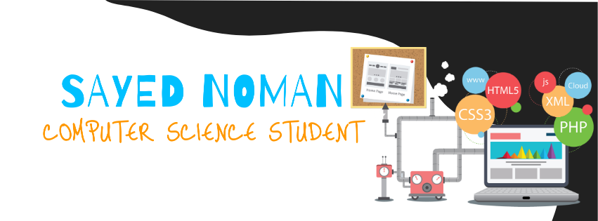

    

  <samp>
    I'm <a href="https://github.com/Sayed-Noman/">Noman</a> currently a Third Year CSE student at <a href="http://www.northsouth.edu/">North South University :school: </a> and aspiring software engineer:computer:. Interested in working on backend, API's, Databases and currently learning about Distributed Ledger Technology. Occasionaly I do participate in Hackathons :bulb: and I have a love/hate relationship with Programming :neutral_face:
  </samp>

    
  
    
  

<!-- - 👋 Hi, I’m @Sayed-Noman
- 👀 I’m interested in ...
- 🌱 I’m currently learning ...
- 💞️ I’m looking to collaborate on ...
- 📫 How to reach me ...
-->

<!---
Sayed-Noman/Sayed-Noman is a ✨ special ✨ repository because its `README.md` (this file) appears on your GitHub profile.
You can click the Preview link to take a look at your changes.
--->
